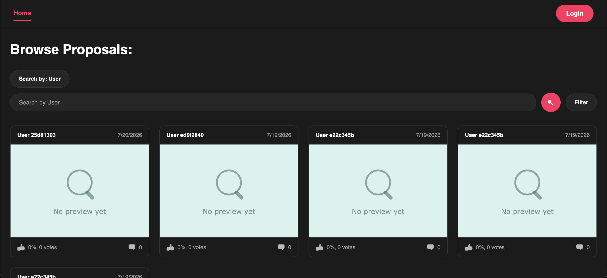

## Table of Contents

1. [Product Information](#product-information)
2. [Team Information](#team-information)
3. [Design Documents](#design-documents)

## Product Information

Product name: CRMP

Product summary:

Screenshot of Main Screen (Browsing Page):


## Team Information

Team Name: Make No Mistakes

Member Names:

- Amelie Breton, amelie.breton@mail.utoronto.ca
- Le Xu, lemon.xu@mail.utoronto.ca
- Xin Chen, phoebechen.chen@mail.utoronto.ca
- Andy Yang, a.yang@mail.utoronto.ca
- Vincent Lam, vin.lam@mail.utoronto.ca

## Design Documents

Project Proposal:
https://docs.google.com/document/d/15cw1lSDrG1fyzA78g8930l5ecIyO_Wq_aeLcFtWy7Vc

Class Diagram:

## Demo Feedback

### Demo 1: 06/23/2026
"UI needs improvements; basic colors, navbar UX; it is out of order"
- To improve on this feedback, the navigation bar has been rearranged, and colors are used to indicate the current screen.

### Demo 2: 07/07/2026
"Great job! The core functionality works well, and the app shows solid progress overall."

### Demo 3: 07/21/2026
"The design rehaul really stands out."

## Team Meetings

### Meeting 1: 05/14/2026
* Meeting minutes: ~100 minutes
* Topic discussed: Team contract, work distribution.
* We decided to do the CRMP option, and discussed the requirements we'd need to accomplish throughout the project.

### Meeting 2: 05/22/2026
* Meeting minutes: ~70 minutes
* Topic discussed: issues for milestone one and a general plan for the remaining milestones, work distribution for demo 1

### Meeting 3: 06/06/2026
* Meeting minutes: ~50 minutes
* Topic discussed: continued discussion with current progress as well as roadblocks we were facing

### Meeting 4: 06/09/2026
* Meeting minutes: ~50 minutes
* Topic discussed: made a rough outline for what we want to accomplish for each sprint, and checked with TA

### Meeting 5: 06/23/2026
* Meeting minutes: ~20 minutes
* Topic discussed: debriefed on sprint 1, reviewed what we wanted to do for sprint 2, and scheduled a more in-depth meeting.

### Meeting 6: 06/27/2026
* Meeting minutes: ~60 minutes
* Topic discussed: distributed work for sprint 2 and went further into detail about the issues we want to complete

### Meeting 7: 07/10/2026
* Meeting minutes: ~60 minutes
* Topic discussed: distributed work for sprint 3 and went further into detail about the issues we want to complete

### Meeting 8: 07/24/2026
* Meeting minutes: ~60 minutes
* Topic discussed: distributed work for sprint 4 and went further into detail about the issues we want to complete

### Meeting 9: 07/28/2026
* Meeting minutes: ~60 minutes
* Topic discussed: checked in on progress, discussed roadblocks

### Meeting 9: 07/31/2026
* Meeting minutes: ~40 minutes
* Topic discussed: checked in on progress and estimated completion date

## Informal Set Up Guide (check Wiki for more!):
If you will be viewing the project using Docker, make sure that you have it installed before starting:

### With VS Code and Docker: (Inside a folder for this project)
- To clone:
```bash
git clone https://github.com/UTSC-CSCC01-Software-Engineering-I/course-project-make-no-mistakes
```
- From there, you may use Docker for a fresh rebuild:
```bash
docker compose build --no-cache
docker compose up
```
- If you want to start without rebuilding, you just need to do:
```bash
docker compose up
```
- After this, it's possible to access the project using the link: http://localhost:5173/
- To check test cases, navigate to the client or server folder, and do:
```bash
pnpm test
```
- This would run all tests for that side
