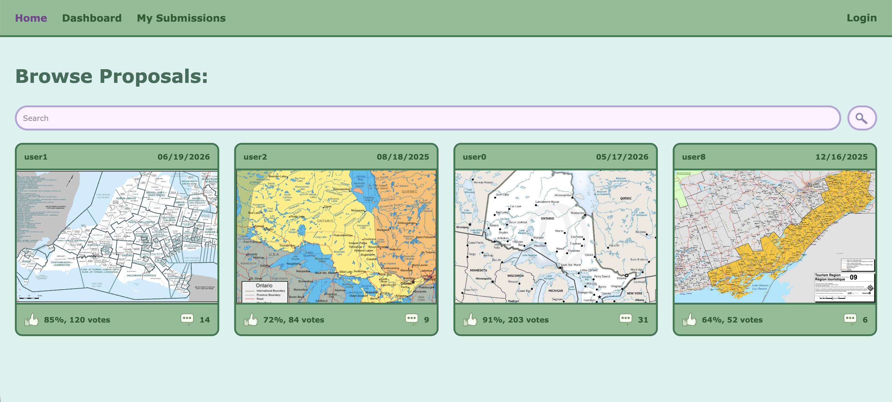

## Table of Contents

1. [Product Information](#product-information)
2. [Team Information](#team-information)
3. [Design Documents](#design-documents)

## Product Information

Product name: CRMP

Product summary:

Screenshot of Main Screen (Browsing Page):


## Team Information

Team Name: Make No Mistakes

Member Names:

- Amelie Breton, amelie.breton@mail.utoronto.ca
- Le Xu, lemon.xu@mail.utoronto.ca
- Xin Chen, phoebechen.chen@mail.utoronto.ca
- Andy Yang, a.yang@mail.utoronto.ca
- Vincent Lam, vin.lam@mail.utoronto.ca

## Design Documents

Project Proposal:
https://docs.google.com/document/d/15cw1lSDrG1fyzA78g8930l5ecIyO_Wq_aeLcFtWy7Vc

Class Diagram:

## Demo Feedback

### Demo 1: 06/23/2026
"UI needs improvements; basic colors, navbar UX; it is out of order"
- To improve on this feedback, the navigation bar has been rearranged, and colors are used to indicate the current screen.

## Local development (database-backed API)

The React client loads proposals, comments, and user submissions through REST
calls in `client/src/apiService.js`. Express routes query Sequelize models.
Socket.io is only used for live comment/vote notifications after data is saved.

### Important: two separate Supabase projects

| Purpose | Env vars | Project |
|---------|----------|---------|
| **Auth** (login / JWT) | `AUTH_SUPABASE_URL`, `AUTH_SUPABASE_PUBLISHABLE_KEY`, optional `AUTH_SUPABASE_SECRET_KEY` / `AUTH_SUPABASE_JWKS_URL` | Teammate auth project — do **not** use for Postgres |
| **Data** (Postgres) | `DATABASE_URL` | `db.sckuxldttzxrriqtseyz.supabase.co` |

Legacy aliases `SUPABASE_URL` / `SUPABASE_PUBLISHABLE_KEY` still work for auth if `AUTH_*` are unset.

Authenticated users are verified against the **auth** project, then mapped to a local
`User` row (`authUserId`) in the **data** Postgres database. Voting uses that local user id.

### 1. Configure environment (`server/.env`)

```bash
cp server/.env.example server/.env
```

Fill in:

```env
AUTH_SUPABASE_URL=https://<auth-project>.supabase.co
AUTH_SUPABASE_PUBLISHABLE_KEY=<auth-publishable-key>

# Data project password from: Data Supabase → Settings → Database
# Percent-encode special characters in the password (@ → %40, # → %23, …)
DATABASE_URL=postgresql://postgres:<PASSWORD>@db.sckuxldttzxrriqtseyz.supabase.co:5432/postgres

PORT=8080
```

If `DATABASE_URL` is empty, the server falls back to local SQLite (dev only).

### 2. Install dependencies

```bash
cd server && npm install
cd ../client && npm install
```

### 3. Seed temporary JSON into the database (once; safe to re-run)

```bash
cd server
npm run seed
```

Uses `DATABASE_URL` when present. Imports proposals/comments fixtures and sample
submissions without duplicating existing rows.

### 4. Run both servers (two terminals)

```bash
# Terminal 1 — API + Socket.io on :8080
cd server
npm run dev

# Terminal 2 — Vite React app on :5173 (proxies /api and /auth → :8080)
cd client
npm run dev
```

Open http://localhost:5173

### API overview

| Method | Path | Notes |
|--------|------|--------|
| GET | `/api/proposals?sort=&minVotes=&page=&limit=` | DB-filtered browse |
| GET | `/api/proposals/:id` | Single proposal (+ `currentUserVote` if logged in) |
| PATCH | `/api/proposals/:id/vote` | Auth — `{ "value": 1 \| -1 }`, one vote per user |
| GET | `/api/proposals/:id/comments` | Approved comments |
| POST | `/api/proposals/:id/comments` | Auth required |
| PATCH | `/api/comments/:id/vote` | Auth — `{ "value": 1 \| -1 }`, one vote per user |
| GET/DELETE | `/api/comments...` | List (legacy), delete |
| GET | `/api/users/me/submissions` | Auth — current user only |

Static assets under `server/public` and the Vite build are served with long
cache headers; `/api/*` responses use `Cache-Control: no-store`.

### Committing Changes:
- git add .
- git commit -m "message"
- git push

### If it's a new branch, need to do:
- git push -u origin branchName

- git push -u origin HEAD (if pushing the branch that you're currently on, for the first time)
