# Class Diagram

```mermaid
classDiagram
direction LR

namespace Frontend {
  class App {
    +Routes
  }

  class RoleProvider {
    +role
    +loading
    +refreshRole()
  }

  class RequireRole {
    +role
    +children
  }

  class NavBar {
    +renderLinksByRole()
  }

  class BrowsePage {
    +proposals
    +searchQuery
    +searchType
    +sortOption
    +filterProposals()
    +sortProposals()
  }

  class ViewProposalPage {
    +proposal
    +liveComments
    +selectedRegion
    +province
    +boundaryLayer
    +handleCommentSubmit()
    +handleDeleteComment()
    +incrementLikes()
  }

  class SubmitCounterProposalPage {
    +rationaleText
    +selectedRidingId
    +mapData
    +handleSubmit()
  }

  class SubmitObjectionPage {
    +selectedPoint
    +relatedRidings
    +reasonText
    +handleSubmit()
  }

  class UserSubmissionsPage {
    +activeTab
    +submissions
    +searchDate
  }

  class CommissionerDashboardPage {
    +dashboardProposals
    +dashboardComments
    +selectedHeatmapType
    +buildOverviewItems()
    +buildCommissionerHeatmap()
  }

  class CommissionerSubmissionsPage {
    +submissions
    +selectedType
    +statusFilter
    +updateStatus()
    +exportRows()
  }

  class CommissionerReviewPanel {
    +submissionId
    +tags
    +notes
    +handleToggleTag()
    +handleSubmitNote()
  }

  class Map {
    +mode
    +province
    +boundaryLayer
    +onDrawChange()
    +onRegionSelect()
    +simplifyDrawing()
    +clearSelectedRegion()
  }

  class ProposalPreview {
    +proposalId
    +postUser
    +postDate
    +postRating
    +postComments
  }

  class ProposalComment {
    +commentId
    +postUser
    +postDate
    +postComment
    +postLikes
    +postDownvotes
    +handleVote()
  }

  class SearchBar {
    +value
    +searchType
    +sortOption
    +onSearchTypeChange()
    +onSortOptionChange()
  }

  class LoginPage {
    +email
    +password
    +login()
  }

  class RegisterPage {
    +email
    +password
    +register()
  }
}

namespace Client_API {
  class proposalsApi {
    +fetchProposals()
    +fetchProposal(id)
    +fetchMyProposals()
    +createProposal(payload)
    +updateProposalStatus(id, status)
  }

  class objectionsApi {
    +fetchObjections()
    +fetchMyObjections()
    +createObjection(payload)
  }

  class commissionerApi {
    +fetchSubmissions()
    +fetchTags(id)
    +updateTags(id, tags)
    +fetchNotes(id)
    +createNote(id, note)
  }

  class authToken {
    +getToken()
    +setToken(token)
    +clearToken()
  }

  class useRole {
    +role
    +loading
    +refreshRole()
  }
}

namespace Backend {
  class ExpressServer {
    +mountRoutes()
    +listen(port)
  }

  class AuthRouter {
    +postLogin()
    +postRegister()
  }

  class RoleRouter {
    +getCurrentUserRole()
  }

  class ProposalsRouter {
    +listCounterProposals()
    +listMyCounterProposals()
    +getCounterProposal(id)
    +createCounterProposal()
    +updateProposalStatus(id, status)
  }

  class ObjectionsRouter {
    +listObjections()
    +listMyObjections()
    +getObjection(id)
    +createObjection()
  }

  class CommentsRouter {
    +listApprovedComments(proposalId)
    +createComment()
    +deleteComment(id)
    +voteOnComment(id)
  }

  class SubmissionNotesRouter {
    +listNotes(submissionId)
    +createNote(submissionId)
  }

  class SubmissionTagsRouter {
    +getTags(submissionId)
    +replaceTags(submissionId)
  }

  class RequireRoleMiddleware {
    +requireAuth()
    +requireCommissioner()
  }

  class CommentWorker {
    +addCommentToQueue(commentId)
    +reviewComment(comment)
    +emitResult()
  }

  class SupabaseClient {
    +auth.getUser()
  }

  class SupabaseAdminClient {
    +from(table)
    +rpc(name, params)
    +auth.admin
  }
}

namespace Data_Model {
  class User {
    +uuid id
    +string email
  }

  class Profile {
    +uuid id
    +user_role role
    +string display_name
    +timestamp created_at
    +timestamp updated_at
  }

  class Submission {
    +uuid id
    +string public_reference_number
    +uuid user_id
    +submission_type submission_type
    +int[] related_ridings
    +jsonb target_block_ids
    +jsonb map_data
    +geometry geometry
    +string body
    +submission_status status
    +int likes
    +timestamp created_at
  }

  class Comment {
    +int id
    +string content
    +string proposalId
    +string userId
    +string status
    +int upvotes
    +int downvotes
    +string rejectionReason
    +string authorName
  }

  class CommentVote {
    +int id
    +int commentId
    +string userId
    +string action
  }

  class SubmissionNote {
    +uuid id
    +uuid submission_id
    +uuid commissioner_id
    +string note
    +timestamp created_at
  }

  class SubmissionTag {
    +uuid submission_id
    +submission_tag[] tags
    +uuid updated_by
    +timestamp updated_at
  }
}

App *-- RoleProvider
App *-- NavBar
App *-- BrowsePage
App *-- ViewProposalPage
App *-- SubmitCounterProposalPage
App *-- SubmitObjectionPage
App *-- UserSubmissionsPage
App *-- CommissionerDashboardPage
App *-- CommissionerSubmissionsPage

RequireRole --> useRole
RoleProvider --> useRole
NavBar --> useRole

BrowsePage --> SearchBar
BrowsePage --> ProposalPreview
BrowsePage --> proposalsApi

ViewProposalPage --> Map
ViewProposalPage --> ProposalComment
ViewProposalPage --> CommissionerReviewPanel
ViewProposalPage --> proposalsApi

SubmitCounterProposalPage --> Map
SubmitCounterProposalPage --> proposalsApi
SubmitObjectionPage --> Map
SubmitObjectionPage --> objectionsApi
UserSubmissionsPage --> proposalsApi
UserSubmissionsPage --> objectionsApi
CommissionerDashboardPage --> proposalsApi
CommissionerSubmissionsPage --> commissionerApi
CommissionerReviewPanel --> commissionerApi
ProposalComment --> CommentsRouter

ExpressServer *-- AuthRouter
ExpressServer *-- RoleRouter
ExpressServer *-- ProposalsRouter
ExpressServer *-- ObjectionsRouter
ExpressServer *-- CommentsRouter
ExpressServer *-- SubmissionNotesRouter
ExpressServer *-- SubmissionTagsRouter

AuthRouter --> SupabaseClient
RoleRouter --> RequireRoleMiddleware
RoleRouter --> SupabaseAdminClient
ProposalsRouter --> RequireRoleMiddleware
ProposalsRouter --> SupabaseAdminClient
ObjectionsRouter --> RequireRoleMiddleware
ObjectionsRouter --> SupabaseAdminClient
CommentsRouter --> SupabaseClient
CommentsRouter --> Comment
CommentsRouter --> CommentVote
CommentsRouter --> CommentWorker
SubmissionNotesRouter --> RequireRoleMiddleware
SubmissionNotesRouter --> SupabaseAdminClient
SubmissionTagsRouter --> RequireRoleMiddleware
SubmissionTagsRouter --> SupabaseAdminClient

User "1" -- "1" Profile
User "1" -- "0..*" Submission
User "1" -- "0..*" Comment
User "1" -- "0..*" CommentVote
User "1" -- "0..*" SubmissionNote : commissioner
User "1" -- "0..*" SubmissionTag : updated_by

Submission "1" -- "0..*" Comment : proposalId
Submission "1" -- "0..*" SubmissionNote
Submission "1" -- "0..1" SubmissionTag
Comment "1" -- "0..*" CommentVote
```

## Notes

- The frontend is implemented with React function components, but the diagram treats major components/pages as classes for UML readability.
- `Submission` is the shared Supabase table for counter-proposals and objections. The type is distinguished by `submission_type`.
- `Comment` and `CommentVote` are currently Sequelize/SQLite models, while profiles, submissions, commissioner notes, and tags are Supabase/Postgres tables.
- Commissioner-only behavior is enforced through `RequireRole` on the client and `requireCommissioner` middleware on protected server routes.
